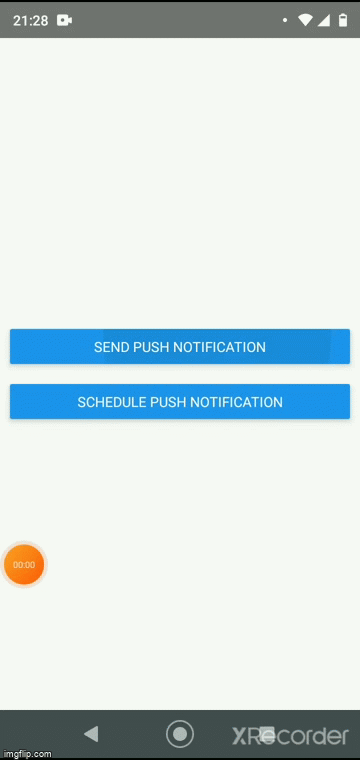

# React Native Local Push Notification

Implementing simple push notification with react-native-push-notification lib.

<p align="center">
  
</p>

## Start Project

Installing Packages

```sh
yarn
```

Run Server

```sh
yarn start
```

In new terminal, run on device

```sh
yarn android
```
